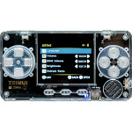

# TRIMUI

  
|Component|Description                               |
|---------|------------------------------------------|
|CPU      |Allwinner F1C200S ARM9 408MHz             |
|RAM      |64MB                                      |
|Screen   |2.0" IPS 320x240(GC9308)                  |
|Slot     |MicroSD                                   |
|Gamepad  |DPad, 4 Buttons, Start, Select, Menu, L, R|
|USB      |Client                                    |
|Battery  |3.7V 600mA                                |
|Dimension|106mm x 56mm x 10mm                       |
|Weight   |64g                                       |
  
### https://steward-fu.github.io/website/index.htm

